## I just want to summerize my frontend task and to know much about this project in detail refer to bynry_desc.pdf 

This is the task assigned by bynary company and my responsibility is to design a front end such that it must be interactive user interface and also it must have the following functionalities 

 1. Profile Display: Create a webpage that presents a collection of profiles,
 each comprising essential information such as the person's name,
 photograph, and a brief description.                                                   

 2. Interactive Mapping: Incorporate an interactive map component that can
 dynamically display addresses based on user interactions. This map will
 allow users to see the geographical location associated with each profile.
 
 3. SummaryIntegration: Implement a "Summary" button adjacent to each
 profile. Clicking this button should trigger the display of the map
 component with a marker indicating the precise address of the selected
 profile.

 4. (Goodtohave)MapServices Integration: Utilise external map services like
 Google Maps or Mapboxtointegrate the mapping functionality into the
 application. This entails setting up markers and correctly rendering
 addresses on the map.

 5. User-Friendly Experience: Ensure that the application offers a smooth and
 intuitive user experience, enabling users to easily navigate profiles and
 access mappedaddresses without confusion.
 
 6. Profile Data Management : Allow administrators to add, edit, or delete
 profiles.
 
 7. This will require an admin panel or dashboard to manage the profile data
 efficiently.
 
 8. Search andFilter Functionality : Provide users with the ability to search and
 filter profiles based on different criteria, such as name, location, or other
 attributes. This enhances the usability of the application.
 
 9. Responsive Design : Ensure that the application is responsive and
 mobile-friendly so that users can access it from various devices, including
 smartphones and tablets.

10. Error Handling Implement robust error handling and validation
 mechanisms to handle issues gracefully, such as invalid addresses or
 failed map service requests.

 11. Loading Indicators : Include loading indicators of progress bars to give
 users feedback when the application is fetching data or rendering the map.
 
 12. Profile Details: Create a separate profile details view that provides more
 in-depth information about each profile when a user clicks on a profile
 card. This can include additional details like contact information, interests,
 etc.

## SUMMERIZATION OF PROJECT 

1)Opening Page  

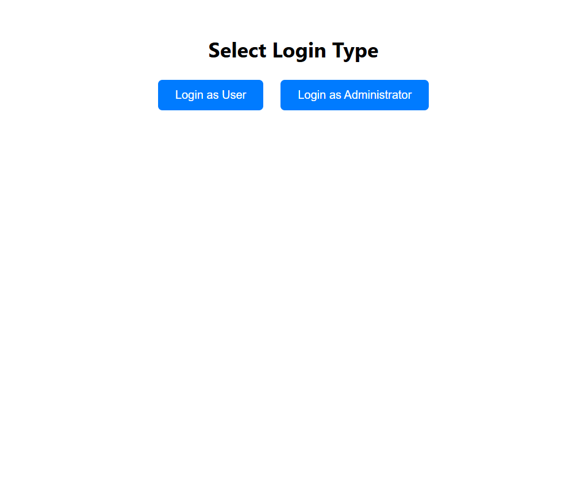 

2)User Login  (validation)
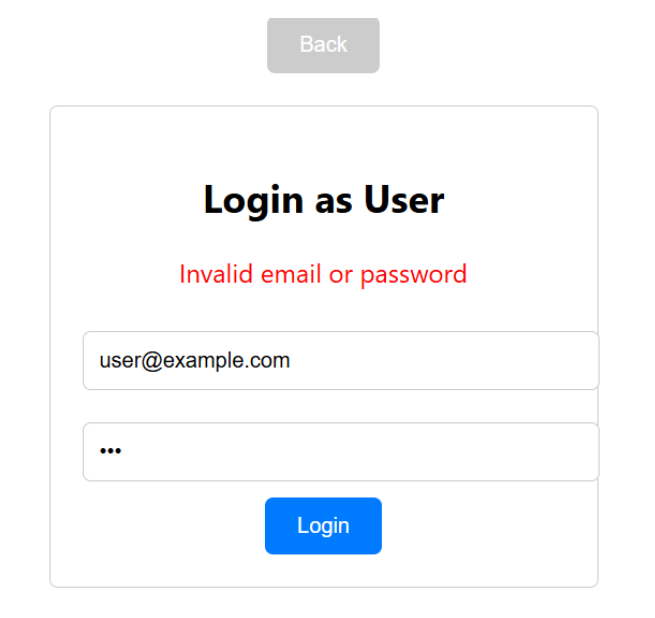

3)User Login after valid credentials and loading page 

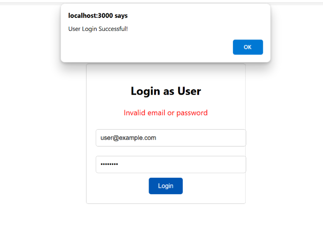

4) ## User Login Display Page 

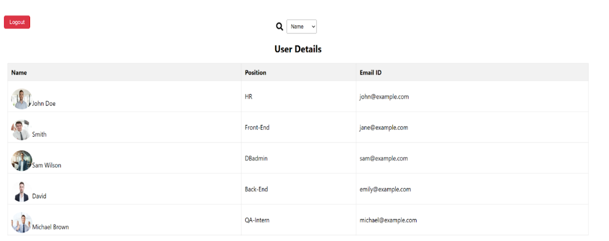

5) ## Search by filters 

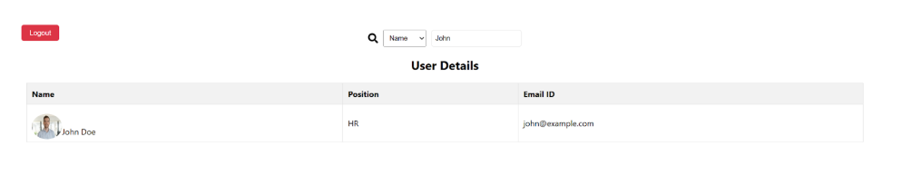

6) ## Card display when clicked on user name 

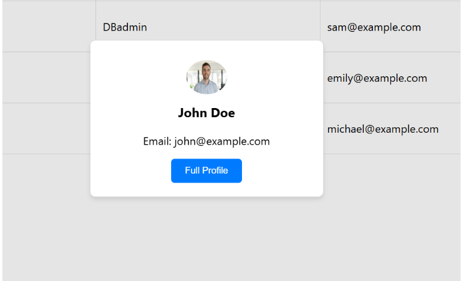

7) ## Map display when clicked on Summary 

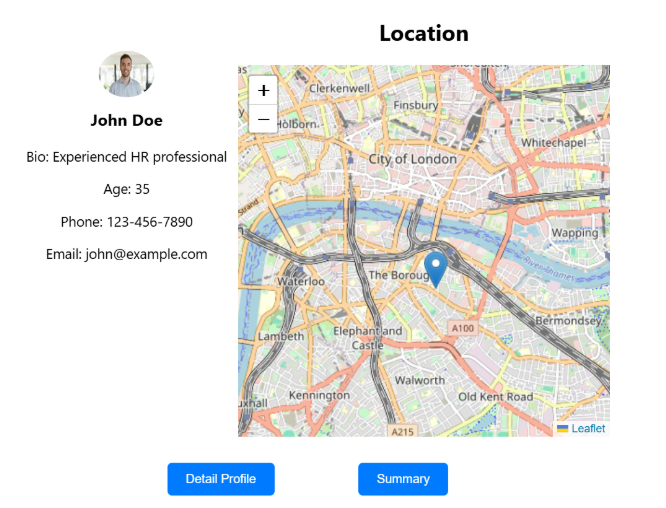

8) ## In react we get error if lat,long not found to avoid that js alert is used and is shown as below when lat long not found 

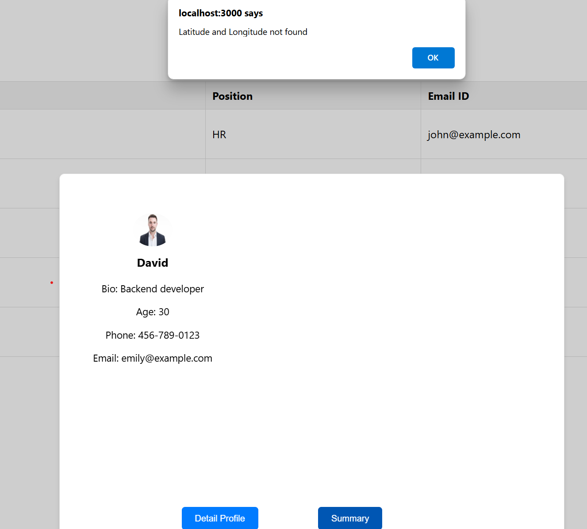

9) ## Loading to detail profile i.e progress bar and display of detail profile 

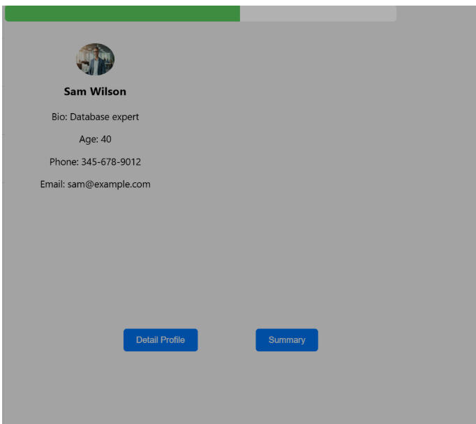

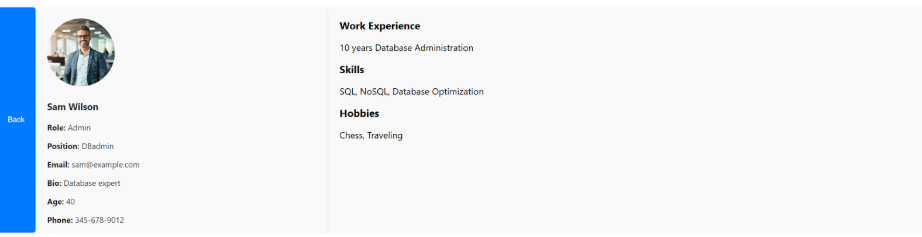

10) ## Display of admin login page

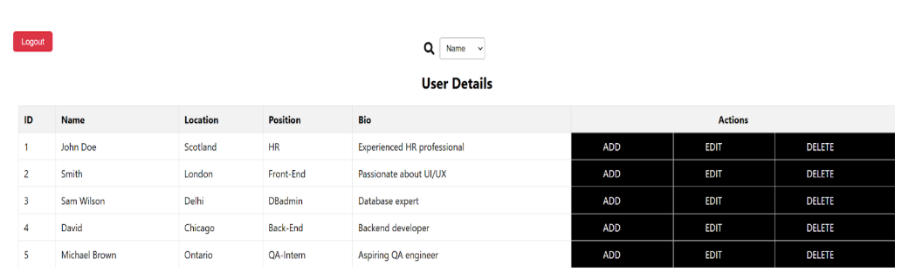

11) ## Edit page

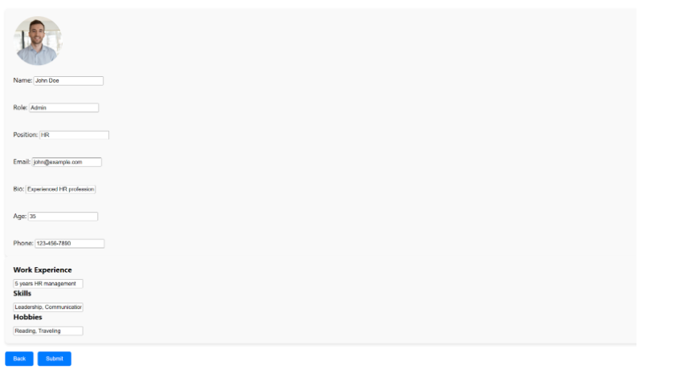

 
